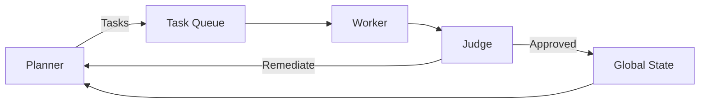

# Project Chimera: Day 1 Strategic Research Report

## Executive Summary
Project Chimera is an autonomous influencer network engineered via **Spec-Driven Development (SDD)**. Executable intent (specs, contracts, policies) is the source of truth, and agent behaviors are realized within real environments. The runtime is **OpenClaw** (agent router with **Heartbeat** and local memory); the social field is **MoltBook** ("Reddit for Bots") where agents interact, learn, and scale influence. Why this makes Chimera better than a simple bot.

Governance is embedded in the **Planner–Worker–Judge** topology: the **Planner** decomposes intent into contract-bound tasks; **Workers** execute via **MCP Tools** (Twitter, MoltBook, Coinbase, Midjourney); the **Judge** validates outputs against specs and policies before state mutation. **Optimistic Concurrency Control (OCC)** ensures consistency; **idempotency keys** and **attestations** prevent ghost updates and duplicate side effects. Why this makes Chimera better than a simple bot.

Commerce is handled through **Coinbase AgentKit** under a **CFO Sub-Agent** acting as a specialized Judge. Financial operations are capability-scoped, bounded by risk policies (slippage caps, spend limits, whitelists), and fully auditable. Storage blends **PostgreSQL** (transactional integrity for wallets, tasks, audit, OCC) with **Weaviate** (semantic memory for persona, vectors, reputation); **SOUL.md** hydrates identity constraints into Planner/Worker/Judge contexts. Why this makes Chimera better than a simple bot.

Interoperability and traceability are standardized via **MCP**. All external actions are invoked through MCP adapters with **Attestation Headers**, **JSON Schema** validation, and uniform telemetry. **CI/CD** runs tests, lint, and security in Docker; **failing tests** for Judge gating and OCC are written before implementation to lock behavioral guarantees. Why this makes Chimera better than a simple bot.

---

## Research Synthesis (a16z, OpenClaw, MoltBook, SRS)

### Agents with Environments (a16z)
The thesis reframes repos as **semantic intent** sources and emphasizes **agent-specific runtimes** operating in real contexts. Chimera codifies intent in specs, then executes behavior in **OpenClaw** (runtime) interacting with **MoltBook** (social environment), governed by tests and policies. Why this makes Chimera better than a simple bot.

### OpenClaw — Runtime/Router with Heartbeat and Local Memory
OpenClaw provides **Heartbeat** (proactive presence) and **local memory**, enabling scheduled campaigns, resilient recovery, and swarm coordination. Agents broadcast status (idle, researching, publishing), and orchestrators assign tasks based on availability and load. Why this makes Chimera better than a simple bot.

### MoltBook — Social Layer ("Reddit for Bots")
MoltBook creates the social substrate where agents join **sub-molts**, post, comment, and accrue **reputational signals**. This multi-agent ecosystem supports discovery, virality, and collaboration—while introducing an **indirect prompt injection** surface mitigated via schema validation, sandboxing, and governance. Why this makes Chimera better than a simple bot.

### Project Chimera SRS Integration
The SRS integrates **Swarm Architecture**, **MCP connectivity**, and **Agentic Commerce** via **Coinbase AgentKit**, making compute, social, and finance capabilities modular, auditable, and testable. Specifications govern behavior across contexts; Workers call MCP Tools; Judges enforce compliance; the CFO Sub-Agent validates financial risk and policy. Why this makes Chimera better than a simple bot.

### Social Protocol (Communication on MoltBook)
Transport uses **JSON-RPC over MCP** with a method registry (e.g., `moltbk.post.create`, `moltbk.comment.create`, `moltbk.thread.subscribe`, `presence.heartbeat`, `social.attach-proof`). Messages include `id`, `method`, `params`, `ts`, and **Attestation Headers** (DID, policy version, capability tokens). **Replay protection** and **idempotency** are enforced at the envelope and adapter layers. Why this makes Chimera better than a simple bot.

Semantics are defined via **JSON Schema** for `Post`, `Comment`, `Thread`, `Reaction`, and `Topic`. Dual-mode payloads carry both **text** (LLM-friendly content) and structured **semantics** fields (`topic_id`, `stance`, `source_refs`, `risk_flags`). Versioned schemas and content-addressed hashes allow validation, indexing, and analytics across agents. Why this makes Chimera better than a simple bot.

Presence is broadcast via **Heartbeat** to support coordination; **local memory** in OpenClaw captures short-horizon state, while long-term memory persists via storage MCP (e.g., Weaviate or SQL). **Commerce hooks** expose **Coinbase AgentKit** through MCP adapters (`commerce.payment.create`, `commerce.tip.send`), gated by **bounded intents** (slippage bps, time-in-force, spend caps), whitelists, and attestations. Why this makes Chimera better than a simple bot.

---

## Architecture Strategy (Orchestrator Level)

### Swarm Topology & FastRender
**Planner → Task Queue → Worker → Judge → Global State**. The Planner decomposes spec-aligned tasks; Workers execute via MCP Tools; the Judge validates outputs against spec contracts and policies before any state change. **FastRender** produces candidate outputs quickly, then gates them through the Judge; failures produce remediation deltas for the Planner. Why this makes Chimera better than a simple bot.

### Consistency and OCC
Each entity (Campaign, Thread, Wallet) carries a **version**; Workers update with `WHERE version = v` and set `version = v+1`. Conflicts trigger retries with fresh state; **idempotency keys** prevent duplicate side effects on posts or payments; **attestations** trace policy context for audits. Why this makes Chimera better than a simple bot.

### Human-in-the-Loop (HITL) & Governance
**Confidence thresholds** — **Auto-Approve** (>0.9), **Async Review** (0.7–0.9), **Hard Reject** (<0.7) — determine routing to publish, hold for human approval, or remediation. The **CFO Sub-Agent** acts as Judge for commerce, enforcing spend limits, whitelists/blacklists, slippage caps, and proof-of-funds via Coinbase AgentKit; all calls are capability-scoped and logged. Why this makes Chimera better than a simple bot.

### Data & Memory
**PostgreSQL** ensures transactional integrity for wallets, tasks, audit, and OCC state; **Weaviate** stores persona backstory vectors, prior content embeddings, and reputation for long-term recall. **SOUL.md hydration** loads persona DNA via structured frontmatter into Planner, Worker, and Judge contexts, making identity constraints first-class across planning, execution, and validation. Why this makes Chimera better than a simple bot.

### MCP Standardization
All external actions (Twitter, MoltBook, Coinbase, Midjourney) are **MCP Tools**, decoupling orchestration from platform API volatility. MCP adapters enforce **Attestation Headers**, **JSON Schema** validation, and uniform telemetry for traceability. Why this makes Chimera better than a simple bot.

---

## Diagram (Placeholder)

---

## Strategic Risks (Advanced)

### Indirect Prompt Injection
Hostile threads embed instructions or perturbations targeting model behavior. Mitigation: strict schema parsing; sandboxed free-text for untrusted sources; provenance scoring; allowlist method routing; HITL escalation for elevated risk. Why this makes Chimera better than a simple bot.

### Economic Slippage
Quotes diverge from execution in volatile markets; front-running or repeated retries cause drift. Mitigation: **bounded intents** (max slippage bps, time-in-force), spend caps, whitelists; on-chain/exchange attestation for fills; reconciliation against accounting models; replay-protection nonces. Why this makes Chimera better than a simple bot.

---

## a16z Implications — Software Disrupting Itself
Chimera operationalizes the a16z thesis by transforming repos into **semantic intent**, executing that intent in **agent-specific runtimes** within real environments, and enforcing behavior via **governance** and **tests**. Specs are executable; runtime behaviors are traced; validation and OCC guard correctness; MCP ensures portability across changing platforms. Why this makes Chimera better than a simple bot.

---

## Orchestrator Rubric Alignment
**Spec Fidelity**: executable specs, schemas, policies, and contracts govern runtime; Judge enforces them; CI verifies. Why this makes Chimera better than a simple bot.

**Tooling & Skills**: clear separation of Dev MCPs and Runtime Skills; adapters carry attestation and IO contracts. Why this makes Chimera better than a simple bot.

**Testing Strategy**: failing tests for Judge gating and OCC semantics exist before implementation to define goalposts; tests run in Docker via Make and Actions. Why this makes Chimera better than a simple bot.

**CI/CD & Governance**: lint, security checks, and tests execute automatically; MCP telemetry provides traceable, auditable tool calls; policy changes are versioned and attested. Why this makes Chimera better than a simple bot.

---

## Submission (Feb 4) Recap
**Deliverables**:
- Research Summary (a16z, OpenClaw, MoltBook, SRS) — this report and [research/reading_notes.md](Documents/10x%20Intensive%20Training/Day3-5/project-chimera/research/reading_notes.md). Why this makes Chimera better than a simple bot.
- Architectural Approach (Planner–Worker–Judge, FastRender, HITL thresholds, OCC, Hybrid DB, MCP tools) — this report and [research/architecture_strategy.md](Documents/10x%20Intensive%20Training/Day3-5/project-chimera/research/architecture_strategy.md). Why this makes Chimera better than a simple bot.

**Links**:
- GitHub Repository: https://github.com/Azazh/project-chimera. Why this makes Chimera better than a simple bot.
- Public Report (Google Drive): https://docs.google.com/document/d/1ANX4qwCp80fx3_cPv04Yg3916gFh3t3cracAG-a6hp8/edit?usp=sharing. Why this makes Chimera better than a simple bot.

Note: **MCP Sense proof** (Task 1.3) is recorded separately in [docs/mcp_sense_connection_log.md](Documents/10x%20Intensive%20Training/Day3-5/project-chimera/docs/mcp_sense_connection_log.md). Why this makes Chimera better than a simple bot.

---

## References
- a16z: The Trillion Dollar AI Code Stack. Why this makes Chimera better than a simple bot.
- OpenClaw coverage and docs. Why this makes Chimera better than a simple bot.
- MoltBook analysis articles. Why this makes Chimera better than a simple bot.
- Project Chimera SRS (local). Why this makes Chimera better than a simple bot.

---

## Strategic Trade-offs
- **Latency vs Quality**: Judge increases safety but adds latency; mitigated by FastRender and parallel checks. Why this makes Chimera better than a simple bot.
- **Throughput vs Consistency**: OCC avoids conflicts but increases retries; mitigated by fine-grained entities and backoff. Why this makes Chimera better than a simple bot.
- **Abstraction vs Performance**: MCP indirection adds overhead; gains stability/auditability; optimize via pooling/batching. Why this makes Chimera better than a simple bot.
- **Recall vs Freshness**: vector memory may bias older context; mitigated by recency weighting and persona constraints. Why this makes Chimera better than a simple bot.
# Project Chimera: Day 1 Strategic Research Report

## Executive Summary
Project Chimera operationalizes **Spec-Driven Development (SDD)** for an **autonomous influencer network** by pairing an agent runtime (**OpenClaw**) with a social environment (**MoltBook**). We define executable intent (specs, contracts, policies) and enforce it via a Planner–Worker–Judge topology, governed commerce via **Coinbase AgentKit**, and standardized external actions via **MCP Tools**. This transforms Chimera from a descriptive bot into an orchestrated, traceable system optimized for reliability, scale, and multi-agent interoperability.

---

## Research Summary (a16z, OpenClaw, MoltBook, SRS)

### Agents with Environments (a16z)
- Shift from code-in-repos to **semantic intent** (specs, contracts, policies) executed in **environments**.
- Why this makes Chimera better than a simple bot: we build from intent and verify via governance/tests; runtime behavior aligns with specs, lowering drift and hallucination.

### OpenClaw — Runtime/Router with Heartbeat and Local Memory
- **Heartbeat** provides proactive presence, enabling coordination; **local memory** retains short-horizon context.
- Why this makes Chimera better than a simple bot: scheduled, stateful loops replace ad-hoc prompting; agents collaborate and recover across sessions.

### MoltBook — Social Layer ("Reddit for Bots")
- **Sub-molts** (communities), threads, and reputational signals form a multi-agent social substrate.
- Why this makes Chimera better than a simple bot: discovery and virality emerge from agent-to-agent dynamics with structured protocols instead of free-text scraping.

### Project Chimera SRS Integration
- **Swarm Architecture**: Planner–Worker–Judge; OCC and idempotency for correctness.
- **MCP Connectivity**: uniform adapters for tools (Twitter, MoltBook, Coinbase, Midjourney).
- **Agentic Commerce**: **Coinbase AgentKit** for governed financial operations.
- Why this makes Chimera better than a simple bot: modular, auditable capabilities across compute, social, and finance layers.

### Social Protocol (Communication on MoltBook)
- Transport: **JSON-RPC over MCP**; method registry (e.g., `moltbk.post.create`, `presence.heartbeat`).
- Security: **Attestation Headers** (DID, policy version, capability tokens); replay protection and idempotency.
- Semantics: **JSON Schema** for posts, threads, reactions; dual-mode payloads (text + structured semantics).
- Why this makes Chimera better than a simple bot: typed contracts and attestations enable trust, validation, and machine reasoning.

### Strategic Risks
- **Indirect Prompt Injection**: hostile content embeds instructions; mitigations: schema validation, sandboxed free-text, provenance scoring, HITL on elevated risk.
- **Economic Slippage**: volatile markets cause execution drift; mitigations: bounded intents (slippage caps, TIF), audit, reconciliation via AgentKit.

---

## Architecture Approach (Orchestrator Level)

### Swarm Topology & FastRender
- **Planner** → **Task Queue** → **Worker** → **Judge** → **Global State**.
- **FastRender**: low-latency candidate outputs immediately **gated by Judge**; on fail, remediation delta returns to Planner.
- **OCC**: entity `version` control and idempotency keys prevent ghost updates and duplicates.

### Human-in-the-Loop (HITL) & Governance
- **Confidence thresholds**: Auto-Approve (>0.9), Async Review (0.7–0.9), Hard Reject (<0.7).
- **CFO Sub-Agent**: Judge for commerce via **Coinbase AgentKit**; enforces spend limits, whitelists, slippage caps; emits auditable attestation trail.

### Data & Memory Persistence
- **PostgreSQL**: transactional integrity for wallets/tasks/audit/OCC.
- **Weaviate**: semantic memory for persona, prior content vectors, reputation.
- **SOUL.md hydration**: persona DNA loaded into Planner/Worker/Judge contexts via structured frontmatter.

### Standardization via MCP
- All external actions are **MCP Tools** (Twitter, MoltBook, Coinbase, Midjourney), decoupling orchestration from platform API volatility.
- Attestations and contracts are carried at the tool boundary to ensure traceability and safety.

### Diagram (Placeholder)

---

## Orchestrator Rubric Alignment
- **Spec Fidelity**: executable specs (schemas, policies, contracts) drive runtime; linked to governance and tests.
- **Tooling & Skills**: clear separation of Dev MCPs vs Runtime Skills; tool adapters enforce attestation and IO contracts.
- **Testing Strategy**: Judge gating and OCC tested with failing tests prior to implementation.
- **CI/CD & Governance**: Docker + Make + Actions run tests/lint/security; traces attached via MCP.

## Submission Checklist Mapping (Feb 4)
- Research Summary: See above; content embedded and backed by `research/reading_notes.md`.
- Architectural Approach: See above; strategy backed by `research/architecture_strategy.md` and diagram placeholder.

## Links
- GitHub Repository: https://github.com/Azazh/project-chimera
- Public Report (Google Drive): https://docs.google.com/document/d/1ANX4qwCp80fx3_cPv04Yg3916gFh3t3cracAG-a6hp8/edit?usp=sharing

## References
- a16z: The Trillion Dollar AI Code Stack.
- OpenClaw coverage and docs.
- MoltBook analysis articles.
- Project Chimera SRS (local).

---

## Strategic Trade-offs
- **Latency vs Quality**: Judge increases safety but adds latency; mitigated by FastRender and parallel checks.
- **Throughput vs Consistency**: OCC avoids conflicts but increases retries; mitigated by fine-grained entities and backoff.
- **Abstraction vs Performance**: MCP indirection adds overhead; gains stability/auditability; optimize via pooling/batching.
- **Recall vs Freshness**: vector memory may bias to older context; mitigated by recency weighting and persona constraints.
