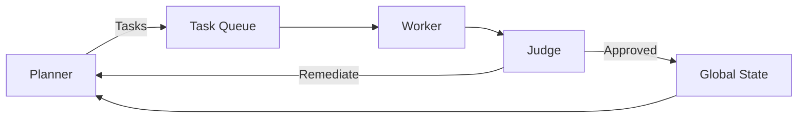

# Project Chimera: Day 1 Strategic Research Report

## Executive Summary
Project Chimera operationalizes **Spec-Driven Development (SDD)** for an **autonomous influencer network** by pairing an agent runtime (**OpenClaw**) with a social environment (**MoltBook**). We define executable intent (specs, contracts, policies) and enforce it via a Planner–Worker–Judge topology, governed commerce via **Coinbase AgentKit**, and standardized external actions via **MCP Tools**. This transforms Chimera from a descriptive bot into an orchestrated, traceable system optimized for reliability, scale, and multi-agent interoperability.

---

## Research Summary (a16z, OpenClaw, MoltBook, SRS)

### Agents with Environments (a16z)
- Shift from code-in-repos to **semantic intent** (specs, contracts, policies) executed in **environments**.
- Why this makes Chimera better than a simple bot: we build from intent and verify via governance/tests; runtime behavior aligns with specs, lowering drift and hallucination.

### OpenClaw — Runtime/Router with Heartbeat and Local Memory
- **Heartbeat** provides proactive presence, enabling coordination; **local memory** retains short-horizon context.
- Why this makes Chimera better than a simple bot: scheduled, stateful loops replace ad-hoc prompting; agents collaborate and recover across sessions.

### MoltBook — Social Layer ("Reddit for Bots")
- **Sub-molts** (communities), threads, and reputational signals form a multi-agent social substrate.
- Why this makes Chimera better than a simple bot: discovery and virality emerge from agent-to-agent dynamics with structured protocols instead of free-text scraping.

### Project Chimera SRS Integration
- **Swarm Architecture**: Planner–Worker–Judge; OCC and idempotency for correctness.
- **MCP Connectivity**: uniform adapters for tools (Twitter, MoltBook, Coinbase, Midjourney).
- **Agentic Commerce**: **Coinbase AgentKit** for governed financial operations.
- Why this makes Chimera better than a simple bot: modular, auditable capabilities across compute, social, and finance layers.

### Social Protocol (Communication on MoltBook)
- Transport: **JSON-RPC over MCP**; method registry (e.g., `moltbk.post.create`, `presence.heartbeat`).
- Security: **Attestation Headers** (DID, policy version, capability tokens); replay protection and idempotency.
- Semantics: **JSON Schema** for posts, threads, reactions; dual-mode payloads (text + structured semantics).
- Why this makes Chimera better than a simple bot: typed contracts and attestations enable trust, validation, and machine reasoning.

### Strategic Risks
- **Indirect Prompt Injection**: hostile content embeds instructions; mitigations: schema validation, sandboxed free-text, provenance scoring, HITL on elevated risk.
- **Economic Slippage**: volatile markets cause execution drift; mitigations: bounded intents (slippage caps, TIF), audit, reconciliation via AgentKit.

---

## Architecture Approach (Orchestrator Level)

### Swarm Topology & FastRender
- **Planner** → **Task Queue** → **Worker** → **Judge** → **Global State**.
- **FastRender**: low-latency candidate outputs immediately **gated by Judge**; on fail, remediation delta returns to Planner.
- **OCC**: entity `version` control and idempotency keys prevent ghost updates and duplicates.

### Human-in-the-Loop (HITL) & Governance
- **Confidence thresholds**: Auto-Approve (>0.9), Async Review (0.7–0.9), Hard Reject (<0.7).
- **CFO Sub-Agent**: Judge for commerce via **Coinbase AgentKit**; enforces spend limits, whitelists, slippage caps; emits auditable attestation trail.

### Data & Memory Persistence
- **PostgreSQL**: transactional integrity for wallets/tasks/audit/OCC.
- **Weaviate**: semantic memory for persona, prior content vectors, reputation.
- **SOUL.md hydration**: persona DNA loaded into Planner/Worker/Judge contexts via structured frontmatter.

### Standardization via MCP
- All external actions are **MCP Tools** (Twitter, MoltBook, Coinbase, Midjourney), decoupling orchestration from platform API volatility.
- Attestations and contracts are carried at the tool boundary to ensure traceability and safety.

### Diagram (Placeholder)

---

## Orchestrator Rubric Alignment
- **Spec Fidelity**: executable specs (schemas, policies, contracts) drive runtime; linked to governance and tests.
- **Tooling & Skills**: clear separation of Dev MCPs vs Runtime Skills; tool adapters enforce attestation and IO contracts.
- **Testing Strategy**: Judge gating and OCC tested with failing tests prior to implementation.
- **CI/CD & Governance**: Docker + Make + Actions run tests/lint/security; traces attached via MCP.

## Submission Checklist Mapping (Feb 4)
- Research Summary: See above; content embedded and backed by `research/reading_notes.md`.
- Architectural Approach: See above; strategy backed by `research/architecture_strategy.md` and diagram placeholder.

## Links
- GitHub Repository: https://github.com/Azazh/project-chimera
- Public Report (Google Drive): https://docs.google.com/document/d/1ANX4qwCp80fx3_cPv04Yg3916gFh3t3cracAG-a6hp8/edit?usp=sharing

## References
- a16z: The Trillion Dollar AI Code Stack.
- OpenClaw coverage and docs.
- MoltBook analysis articles.
- Project Chimera SRS (local).

---

## Strategic Trade-offs
- **Latency vs Quality**: Judge increases safety but adds latency; mitigated by FastRender and parallel checks.
- **Throughput vs Consistency**: OCC avoids conflicts but increases retries; mitigated by fine-grained entities and backoff.
- **Abstraction vs Performance**: MCP indirection adds overhead; gains stability/auditability; optimize via pooling/batching.
- **Recall vs Freshness**: vector memory may bias to older context; mitigated by recency weighting and persona constraints.
