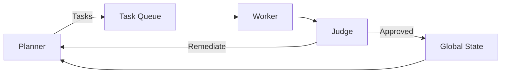

# Project Chimera: Architecture Strategy (Orchestrator Level)

This document elevates Project Chimera from descriptive planning to executable specifications that can be governed, tested, and extended by agents and humans.

## 1. Swarm Topology & FastRender Implementation

### Topology: Planner → Worker → Judge (Hierarchy)
- **Planner**: decomposes intents from `specs/functional.md` into granular tasks with explicit input/output contracts (JSON Schema), enqueues into **Task Queue**.
- **Worker**: executes tasks via **MCP Tool adapters** (e.g., `twitter.post`, `moltbook.publish`, `coinbase.payment`). Workers are stateless; all state mutations are mediated by queues and DB transactions.
- **Judge**: validates every Worker output against **spec contracts** and **policy rules** before the result can reach the **Task Queue** (for follow-on steps) or **Global State**. The Judge emits pass/fail, confidence score, and a remediation plan.

### FastRender Pattern
- **FastRender**: prioritized, low-latency render of candidate outputs followed by immediate **Judge gating**. If confidence ≥ threshold, the output flows forward; otherwise, the Planner receives a remediation delta (e.g., “missing source_refs”).
- Why this is better than a simple bot: **fragile prompts** are replaced by contract-first tasks and a **Judge** that enforces correctness and policy. Outputs cannot bypass validation, preventing silent drift.

### Optimistic Concurrency Control (OCC)
- **Global State** records a `version` per entity (e.g., `Campaign`, `Thread`, `Wallet`). Workers perform `UPDATE ... WHERE version = v` and set `version = v+1`. If the row was modified by another actor, the update fails and the task is retried with fresh state.
- **Ghost updates prevention**: OCC + idempotent task design (deterministic keys for posts/payments) avoids duplicate effects. All side-effectful actions carry **idempotency keys** and **attestations**.

## 2. Human-in-the-Loop (HITL) & Governance Schema

### Confidence Thresholds
- **Auto-Approve**: score > 0.9 → publish or execute automatically.
- **Async Review**: 0.7–0.9 → enqueue for human approval; proceed on approval, otherwise remediate.
- **Hard Reject**: < 0.7 → block, escalate to Planner with failure reasons.

### Governance Roles and CFO Sub-Agent
- **CFO Judge (Finance)**: acts as a specialized **Judge** for commerce-related actions using **Coinbase AgentKit** via MCP. Enforces spend limits, slippage caps, whitelists/blacklists, time-in-force, and proof-of-funds.
- **Policy Schema**: governance policies are versioned, signed, and attached as **Attestation Headers** to every commerce call. The CFO emits an audit trail (intent, constraints, result, reconciliation).
- Why this is better than a simple bot: all high-risk actions are gated by formal policy, scored by Judges, and traced with attestations. HITL triggers on ambiguous cases.

## 3. Data & Memory Persistence Strategy

### Hybrid Database
- **PostgreSQL**: transactional integrity for wallets, tasks, job runs, OCC versions, and audit logs. Strong consistency for financial and workflow state.
- **Weaviate**: semantic long-term memory (persona, backstory, prior content vectors, reputational signals). Enables recall, personalization, and planning over time.

### SOUL.md Hydration
- **SOUL.md**: the agent’s “DNA” (persona, constraints, brand tone, safety rules). At runtime, **Hydrator** loads SOUL.md, extracts structured fields (JSON frontmatter), and injects them into:
  - **Planner context**: task decomposition aligns with persona constraints.
  - **Worker prompts**: parameterized templates reference persona and safety.
  - **Judge rules**: validation includes persona alignment and safety compliance.
- Why this is better than a simple bot: identity and constraints are explicit, versioned, and applied uniformly to planning, execution, and governance.

## 4. Standardization via MCP (Decoupling & Stability)

- All external actions are **MCP Tools** (Twitter, Coinbase, MoltBook, Midjourney). The core logic calls abstract capabilities, not raw platform APIs.
- **Benefits**: decoupling from API volatility, uniform tracing, sandboxing, and capability-scoped tokens. Tool adapters carry **Attestation Headers** and enforce **spec contracts**.
- Why this is better than a simple bot: portability and resilience; platforms can change without breaking orchestration or governance.

## Strategic Trade-offs

- **Latency vs Quality (Judge)**: stricter validation improves safety but adds latency; mitigate via FastRender and parallel Judges for low-risk checks.
- **Throughput vs Consistency (OCC)**: OCC prevents conflicts but can increase retries; mitigate by fine-grained entities and backoff.
- **Abstraction vs Performance (MCP)**: tool indirection adds overhead; gain stability and auditability. Optimize with connection pooling and batched calls.
- **Recall vs Freshness (Weaviate)**: vector recall may surface old context; mitigate with recency weighting and persona constraints.

## Flow Diagram (Placeholder)

---

### Implementation Notes (pointers to specs/tests)
- Define contracts in `specs/technical.md` (JSON Schema; IO for Planner/Worker/Judge).
- Add failing tests in `tests/` to assert Judge gating and OCC semantics before implementation.
- Configure MCP tool adapters for Twitter, MoltBook, Coinbase, and Midjourney with attestation and idempotency.
