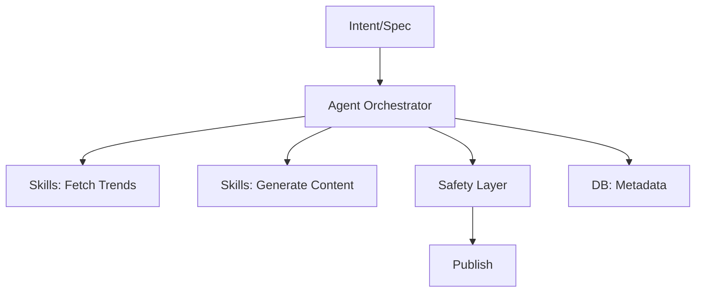

# Architecture Strategy (Feb 4)

Context: Project Chimera — an autonomous influencer system. This document captures the high-level architecture decisions for the prototype factory.

## Agent Pattern
- Candidate patterns: Hierarchical Swarm vs Sequential Chain vs Orchestrator-Worker.
- Selected pattern and rationale:

## Human-in-the-Loop (Safety Layer)
- Approval gates for content generation and publishing.
- Safety checks (toxicity, IP compliance, platform policy) before release.

## Data Storage
- Requirement: high-velocity video metadata, content artifacts, logs.
- SQL vs NoSQL tradeoffs and chosen approach:

## Interfaces & Contracts (Pointer)
- API inputs/outputs to formalize later in `specs/technical.md`.

## Diagrams
- Mermaid.js diagrams are encouraged; example placeholder:

## Next Steps (Post-Feb 4)
- Ratify specs in `specs/` and define ERDs & contracts.
- Draft skills interfaces and failing tests for TDD.
