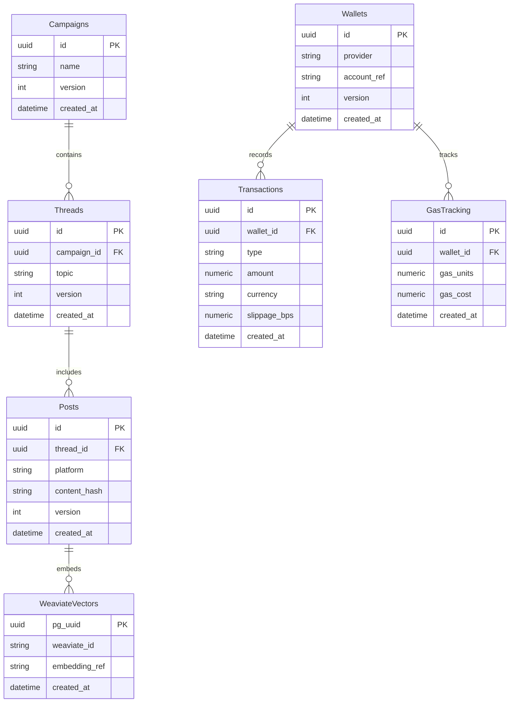

# Project Chimera Technical Specification

Version: 1.0.0

## API Schemas

### TaskObject (JSON Schema)
```json
{
  "$schema": "https://json-schema.org/draft/2020-12/schema",
  "$id": "https://chimera/specs/taskobject.schema.json",
  "title": "TaskObject",
  "type": "object",
  "additionalProperties": false,
  "properties": {
    "id": { "type": "string", "format": "uuid" },
    "agent_role": { "type": "string", "enum": ["PLANNER", "WORKER", "JUDGE"] },
    "payload": { "type": "object" },
    "deadline": { "type": "string", "format": "date-time" },
    "priority": { "type": "integer", "minimum": 0, "maximum": 10 },
    "version": { "type": "integer", "minimum": 0 }
  },
  "required": ["id", "agent_role", "payload", "deadline", "priority", "version"]
}
```

### JudgeReport (JSON Schema)
```json
{
  "$schema": "https://json-schema.org/draft/2020-12/schema",
  "$id": "https://chimera/specs/judgereport.schema.json",
  "title": "JudgeReport",
  "type": "object",
  "additionalProperties": false,
  "properties": {
    "score": { "type": "number", "minimum": 0, "maximum": 1 },
    "feedback_delta": { "type": "object" },
    "status": { "type": "string", "enum": ["APPROVED", "REJECTED"] },
    "task_id": { "type": "string", "format": "uuid" },
    "policy_version": { "type": "string" },
    "persona_version": { "type": "string" }
  },
  "required": ["score", "feedback_delta", "status", "task_id", "policy_version", "persona_version"]
}
```

## Database ERD (Mermaid)


## OpenClaw Communication Protocols

### JSON-RPC over MCP
- Transport: JSON-RPC 2.0 messages carried via MCP tool adapters.
- Required Attestation Headers on every call:
  - `DID`: decentralized identifier of the agent.
  - `Policy_Version`: version string of active governance policy.
  - `Signature`: cryptographic signature over `{method, params, ts}`.
- Standard fields:
  - `id`: unique request id (UUID).
  - `jsonrpc`: "2.0".
  - `method`: e.g., `moltbk.post.create`, `presence.heartbeat`, `commerce.payment.create`.
  - `params`: strictly typed per JSON Schema (referenced by version hash).
  - `ts`: ISO datetime.

Example (create post):
```json
{
  "id": "8f7d2c3a-1b7e-4f0a-9a1a-123456789abc",
  "jsonrpc": "2.0",
  "method": "moltbk.post.create",
  "params": {
    "thread_id": "c2f1b7e2-3af9-4c4b-8c5b-abcdef123456",
    "text": "Trend insight:...",
    "semantics": { "topic_id": "T-42", "stance": "NEUTRAL", "source_refs": ["..."], "risk_flags": [] }
  },
  "ts": "2026-02-05T10:00:00Z",
  "headers": { "DID": "did:key:z...", "Policy_Version": "1.0.0", "Signature": "MEUCIQ..." }
}
```

### Task Manifest (JSON Schema)
The Planner wraps every routed task with a manifest used by the OpenClaw Gateway for deterministic dispatch, governance binding, and idempotency.

```json
{
  "$schema": "https://json-schema.org/draft/2020-12/schema",
  "$id": "https://chimera/specs/taskmanifest.schema.json",
  "title": "TaskManifest",
  "type": "object",
  "additionalProperties": false,
  "properties": {
    "skill_required": { "type": "string", "minLength": 1 },
    "priority": { "type": "string", "enum": ["LOW", "NORMAL", "HIGH", "URGENT"] },
    "timeout_ms": { "type": "integer", "minimum": 100, "maximum": 600000 },
    "idempotency_key": { "type": "string", "pattern": "^[a-zA-Z0-9._:-]{8,128}$" },
    "trace_id": { "type": "string", "pattern": "^[a-zA-Z0-9._:-]{8,128}$" },
    "policy_version": { "type": "string", "minLength": 1 }
  },
  "required": ["skill_required", "priority", "timeout_ms", "idempotency_key", "trace_id", "policy_version"]
}
```

Manifest resolution:
- `skill_required` MUST match a contract in `skills/` (Skill Registry), or dispatch fails with `DISPATCH_ERROR`.
- `idempotency_key` ensures duplicate envelopes return the original decision to prevent duplicate side effects.
- `policy_version` binds governance rules used by the Judge middleware.

### Presence & Memory
- `presence.heartbeat` broadcasts status (`idle`, `researching`, `publishing`) and load hints.
- Local memory: OpenClaw short-horizon state; long-term memory via storage MCP (Weaviate/SQL) keyed by UUIDs.

## Consistency Logic (OCC)
- Every mutable entity includes `version`.
- Update pattern: `UPDATE table SET ... , version = version + 1 WHERE id = :id AND version = :version`.
- On conflict: Worker retries with fresh state from Global State; Planner may re-issue task with updated `version`.
- Side effects: All external posts/payments carry **idempotency keys** derived from `{entity_id, version, method}`.

## Cross-References
- See specs/functional.md for lifecycle and role behaviors.
- See specs/_meta.md for versioning and health.
